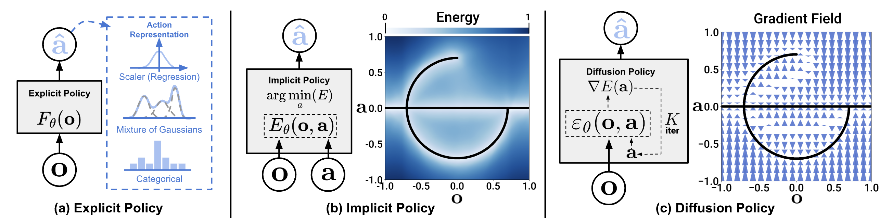

# DiffuseLoco: Real-Time Legged Locomotion Control with Diffusion from Offline Datasets


[[Paper]](https://arxiv.org/abs/2404.19264)


[Xiaoyu Huang](http://cheng-chi.github.io/)<sup>1</sup>,
[Yufeng Chi](https://www.cs.cmu.edu/~sfeng/)<sup>1</sup>,
[Ruofeng Wang](https://yilundu.github.io/)<sup>1</sup>,
[Zhongyu Li](https://www.zhenjiaxu.com/)<sup>1</sup>,
[Xuebin Peng](https://www.eacousineau.com/)<sup>2</sup>,
[Sophia Shao](http://www.benburchfiel.com/)<sup>1</sup>,
[Borivoje Nikolic](https://www.cs.columbia.edu/~shurans/)<sup>1</sup>
[Koushil Sreenath](https://www.cs.columbia.edu/~shurans/)<sup>1</sup>


<sup>1</sup>UC Berkeley,
<sup>2</sup>Simon Fraser University

<!-- 
 -->


## 🧾 Checkout our experiment logs!
For each experiment used to generate Table I,II and IV in the [paper](https://diffusion-policy.cs.columbia.edu/#paper), we provide:
1. A `config.yaml` that contains all parameters needed to reproduce the experiment.
2. Detailed training/eval `logs.json.txt` for every training step.
3. Checkpoints for the best `epoch=*-test_mean_score=*.ckpt` and last `latest.ckpt` epoch of each run.

Experiment logs are hosted on our website as nested directories in format:
`https://diffusion-policy.cs.columbia.edu/data/experiments/<image|low_dim>/<task>/<method>/`

Within each experiment directory you may find:
```
.
├── config.yaml
├── metrics
│   └── logs.json.txt
├── train_0
│   ├── checkpoints
│   │   ├── epoch=0300-test_mean_score=1.000.ckpt
│   │   └── latest.ckpt
│   └── logs.json.txt
├── train_1
│   ├── checkpoints
│   │   ├── epoch=0250-test_mean_score=1.000.ckpt
│   │   └── latest.ckpt
│   └── logs.json.txt
└── train_2
    ├── checkpoints
    │   ├── epoch=0250-test_mean_score=1.000.ckpt
    │   └── latest.ckpt
    └── logs.json.txt
```
The `metrics/logs.json.txt` file aggregates evaluation metrics from all 3 training runs every 50 epochs using `multirun_metrics.py`. The numbers reported in the paper correspond to `max` and `k_min_train_loss` aggregation keys.

To download all files in a subdirectory, use:

```console
$ wget --recursive --no-parent --no-host-directories --relative --reject="index.html*" https://diffusion-policy.cs.columbia.edu/data/experiments/low_dim/square_ph/diffusion_policy_cnn/
```

## 🛠️ Installation
### 🖥️ Simulation
To reproduce our simulation benchmark results, install our conda environment on a Linux machine with Nvidia GPU. On Ubuntu 20.04 you need to install the following apt packages for mujoco:
```console
$ sudo apt install -y libosmesa6-dev libgl1-mesa-glx libglfw3 patchelf
```

We recommend [Mambaforge](https://github.com/conda-forge/miniforge#mambaforge) instead of the standard anaconda distribution for faster installation: 
```console
$ mamba env create -f conda_environment.yaml
```

but you can use conda as well: 
```console
$ conda env create -f conda_environment.yaml
```


### 🦾 Real Robot
Hardware (for Push-T):
* 1x [CyberDog](https://in.event.mi.com/in/cyberdog)


Software:
* Ubuntu 22.04
* IssacGym
* Conda environment `mamba env create -f conda_environment_real.yaml`

## 🖥️ Reproducing Simulation Benchmark Results 

### Running for a single seed
Activate conda environment and login to [wandb](https://wandb.ai) (if you haven't already).
```console
[diffusion_policy]$ conda activate robodiff
(robodiff)[diffusion_policy]$ wandb login
```

Launch training with seed 42 on GPU 0.
```console
(robodiff)[diffusion_policy]$ python train.py --config-dir=. --config-name=image_pusht_diffusion_policy_cnn.yaml training.seed=42 training.device=cuda:0 hydra.run.dir='data/outputs/${now:%Y.%m.%d}/${now:%H.%M.%S}_${name}_${task_name}'
```

This will create a directory in format `data/outputs/yyyy.mm.dd/hh.mm.ss_<method_name>_<task_name>` where configs, logs and checkpoints are written to. The policy will be evaluated every 50 epochs with the success rate logged as `test/mean_score` on wandb, as well as videos for some rollouts.
```console
(robodiff)[diffusion_policy]$ tree data/outputs/2023.03.01/20.02.03_train_diffusion_unet_hybrid_pusht_image -I wandb
data/outputs/2023.03.01/20.02.03_train_diffusion_unet_hybrid_pusht_image
├── checkpoints
│   ├── epoch=0000-test_mean_score=0.134.ckpt
│   └── latest.ckpt
├── .hydra
│   ├── config.yaml
│   ├── hydra.yaml
│   └── overrides.yaml
├── logs.json.txt
├── media
│   ├── 2k5u6wli.mp4
│   ├── 2kvovxms.mp4
│   ├── 2pxd9f6b.mp4
│   ├── 2q5gjt5f.mp4
│   ├── 2sawbf6m.mp4
│   └── 538ubl79.mp4
└── train.log

3 directories, 13 files
```


### 🆕 Evaluate Pre-trained Checkpoints
Download a checkpoint from the published training log folders, such as [https://diffusion-policy.cs.columbia.edu/data/experiments/low_dim/pusht/diffusion_policy_cnn/train_0/checkpoints/epoch=0550-test_mean_score=0.969.ckpt](https://diffusion-policy.cs.columbia.edu/data/experiments/low_dim/pusht/diffusion_policy_cnn/train_0/checkpoints/epoch=0550-test_mean_score=0.969.ckpt).

Run the evaluation script:
```console
(robodiff)[diffusion_policy]$ python eval.py --checkpoint data/0550-test_mean_score=0.969.ckpt --output_dir data/pusht_eval_output --device cuda:0
```

This will generate the following directory structure:
```console
(robodiff)[diffusion_policy]$ tree data/pusht_eval_output
data/pusht_eval_output
├── eval_log.json
└── media
    ├── 1fxtno84.mp4
    ├── 224l7jqd.mp4
    ├── 2fo4btlf.mp4
    ├── 2in4cn7a.mp4
    ├── 34b3o2qq.mp4
    └── 3p7jqn32.mp4

1 directory, 7 files
```

`eval_log.json` contains metrics that is logged to wandb during training:
```console
(robodiff)[diffusion_policy]$ cat data/pusht_eval_output/eval_log.json
{
  "test/mean_score": 0.9150393806777066,
  "test/sim_max_reward_4300000": 1.0,
  "test/sim_max_reward_4300001": 0.9872969750774386,
...
  "train/sim_video_1": "data/pusht_eval_output//media/2fo4btlf.mp4"
}
```

## 🦾 Demo, Training and Eval on a Real Robot
Make sure your UR5 robot is running and accepting command from its network interface (emergency stop button within reach at all time), your RealSense cameras plugged in to your workstation (tested with `realsense-viewer`) and your SpaceMouse connected with the `spacenavd` daemon running (verify with `systemctl status spacenavd`).

Start the demonstration collection script. Press "C" to start recording. Use SpaceMouse to move the robot. Press "S" to stop recording. 
```console
(robodiff)[diffusion_policy]$ python demo_real_robot.py -o data/demo_pusht_real --robot_ip 192.168.0.204
```

This should result in a demonstration dataset in `data/demo_pusht_real` with in the same structure as our example [real Push-T training dataset](https://diffusion-policy.cs.columbia.edu/data/training/pusht_real.zip).

To train a Diffusion Policy, launch training with config:
```console
(robodiff)[diffusion_policy]$ python train.py --config-name=train_diffusion_unet_real_image_workspace task.dataset_path=data/demo_pusht_real
```
Edit [`diffusion_policy/config/task/real_pusht_image.yaml`](./diffusion_policy/config/task/real_pusht_image.yaml) if your camera setup is different.

Assuming the training has finished and you have a checkpoint at `data/outputs/blah/checkpoints/latest.ckpt`, launch the evaluation script with:
```console
python eval_real_robot.py -i data/outputs/blah/checkpoints/latest.ckpt -o data/eval_pusht_real --robot_ip 192.168.0.204
```
Press "C" to start evaluation (handing control over to the policy). Press "S" to stop the current episode.

## 🗺️ Codebase Tutorial
This codebase is structured under the requirement that:
1. implementing `N` tasks and `M` methods will only require `O(N+M)` amount of code instead of `O(N*M)`
2. while retaining maximum flexibility.

To achieve this requirement, we 
1. maintained a simple unified interface between tasks and methods and 
2. made the implementation of the tasks and the methods independent of each other. 

These design decisions come at the cost of code repetition between the tasks and the methods. However, we believe that the benefit of being able to add/modify task/methods without affecting the remainder and being able understand a task/method by reading the code linearly outweighs the cost of copying and pasting 😊.

### The Split
On the task side, we have:
* `Dataset`: adapts a (third-party) dataset to the interface.
* `EnvRunner`: executes a `Policy` that accepts the interface and produce logs and metrics.
* `config/task/<task_name>.yaml`: contains all information needed to construct `Dataset` and `EnvRunner`.
* (optional) `Env`: an `gym==0.21.0` compatible class that encapsulates the task environment.

On the policy side, we have:
* `Policy`: implements inference according to the interface and part of the training process.
* `Workspace`: manages the life-cycle of training and evaluation (interleaved) of a method. 
* `config/<workspace_name>.yaml`: contains all information needed to construct `Policy` and `Workspace`.

### The Interface
#### Low Dim
A [`LowdimPolicy`](./diffusion_policy/policy/base_lowdim_policy.py) takes observation dictionary:
- `"obs":` Tensor of shape `(B,To,Do)`

and predicts action dictionary:
- `"action": ` Tensor of shape `(B,Ta,Da)`

A [`LowdimDataset`](./diffusion_policy/dataset/base_dataset.py) returns a sample of dictionary:
- `"obs":` Tensor of shape `(To, Do)`
- `"action":` Tensor of shape `(Ta, Da)`

Its `get_normalizer` method returns a [`LinearNormalizer`](./diffusion_policy/model/common/normalizer.py) with keys `"obs","action"`.

The `Policy` handles normalization on GPU with its copy of the `LinearNormalizer`. The parameters of the `LinearNormalizer` is saved as part of the `Policy`'s weights checkpoint.

#### Image
A [`ImagePolicy`](./diffusion_policy/policy/base_image_policy.py) takes observation dictionary:
- `"key0":` Tensor of shape `(B,To,*)`
- `"key1":` Tensor of shape e.g. `(B,To,H,W,3)` ([0,1] float32)

and predicts action dictionary:
- `"action": ` Tensor of shape `(B,Ta,Da)`

A [`ImageDataset`](./diffusion_policy/dataset/base_dataset.py) returns a sample of dictionary:
- `"obs":` Dict of
    - `"key0":` Tensor of shape `(To, *)`
    - `"key1":` Tensor fo shape `(To,H,W,3)`
- `"action":` Tensor of shape `(Ta, Da)`

Its `get_normalizer` method returns a [`LinearNormalizer`](./diffusion_policy/model/common/normalizer.py) with keys `"key0","key1","action"`.

#### Example
```
To = 3
Ta = 4
T = 6
|o|o|o|
| | |a|a|a|a|
|o|o|
| |a|a|a|a|a|
| | | | |a|a|
```
Terminology in the paper: `varname` in the codebase
- Observation Horizon: `To|n_obs_steps`
- Action Horizon: `Ta|n_action_steps`
- Prediction Horizon: `T|horizon`

The classical (e.g. MDP) single step observation/action formulation is included as a special case where `To=1` and `Ta=1`.

## 🔩 Key Components
### `Workspace`
A `Workspace` object encapsulates all states and code needed to run an experiment. 
* Inherits from [`BaseWorkspace`](./diffusion_policy/workspace/base_workspace.py).
* A single `OmegaConf` config object generated by `hydra` should contain all information needed to construct the Workspace object and running experiments. This config correspond to `config/<workspace_name>.yaml` + hydra overrides.
* The `run` method contains the entire pipeline for the experiment.
* Checkpoints happen at the `Workspace` level. All training states implemented as object attributes are automatically saved by the `save_checkpoint` method.
* All other states for the experiment should be implemented as local variables in the `run` method.

The entrypoint for training is `train.py` which uses `@hydra.main` decorator. Read [hydra](https://hydra.cc/)'s official documentation for command line arguments and config overrides. For example, the argument `task=<task_name>` will replace the `task` subtree of the config with the content of `config/task/<task_name>.yaml`, thereby selecting the task to run for this experiment.

### `Dataset`
A `Dataset` object:
* Inherits from `torch.utils.data.Dataset`.
* Returns a sample conforming to [the interface](#the-interface) depending on whether the task has Low Dim or Image observations.
* Has a method `get_normalizer` that returns a `LinearNormalizer` conforming to [the interface](#the-interface).

Normalization is a very common source of bugs during project development. It is sometimes helpful to print out the specific `scale` and `bias` vectors used for each key in the `LinearNormalizer`.

Most of our implementations of `Dataset` uses a combination of [`ReplayBuffer`](#replaybuffer) and [`SequenceSampler`](./diffusion_policy/common/sampler.py) to generate samples. Correctly handling padding at the beginning and the end of each demonstration episode according to `To` and `Ta` is important for good performance. Please read our [`SequenceSampler`](./diffusion_policy/common/sampler.py) before implementing your own sampling method.

### `Policy`
A `Policy` object:
* Inherits from `BaseLowdimPolicy` or `BaseImagePolicy`.
* Has a method `predict_action` that given observation dict, predicts actions conforming to [the interface](#the-interface).
* Has a method `set_normalizer` that takes in a `LinearNormalizer` and handles observation/action normalization internally in the policy.
* (optional) Might has a method `compute_loss` that takes in a batch and returns the loss to be optimized.
* (optional) Usually each `Policy` class correspond to a `Workspace` class due to the differences of training and evaluation process between methods.

### `EnvRunner`
A `EnvRunner` object abstracts away the subtle differences between different task environments.
* Has a method `run` that takes a `Policy` object for evaluation, and returns a dict of logs and metrics. Each value should be compatible with `wandb.log`. 

To maximize evaluation speed, we usually vectorize environments using our modification of [`gym.vector.AsyncVectorEnv`](./diffusion_policy/gym_util/async_vector_env.py) which runs each individual environment in a separate process (workaround python GIL). 

⚠️ Since subprocesses are launched using `fork` on linux, you need to be specially careful for environments that creates its OpenGL context during initialization (e.g. robosuite) which, once inherited by the child process memory space, often causes obscure bugs like segmentation fault. As a workaround, you can provide a `dummy_env_fn` that constructs an environment without initializing OpenGL.


